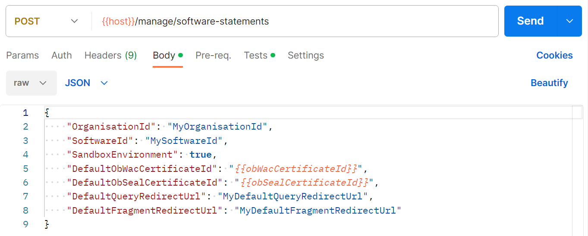

# Add a software statement, certificates and an encryption key description

In this section, we will describe how to perform the following steps:

- [Create an Open Banking software statement and OBWAC/OBSeal certs/keys](#create-an-open-banking-software-statement-and-obwacobseal-certskeys)
- [Add an OBWAC transport certificate to Open Banking Connector](#add-an-obwac-transport-certificate-to-open-banking-connector)
- [Add an OBSeal signing certificate to Open Banking Connector](#add-an-obseal-signing-certificate-to-open-banking-connector)
- [Add a software statement to Open Banking Connector](#add-a-software-statement-to-open-banking-connector)
- [Create an encryption key](#create-an-encryption-key)
- [Add an encryption key description to Open Banking Connector](#add-an-encryption-key-description-to-open-banking-connector)

## Create an Open Banking software statement and OBWAC/OBSeal certs/keys

In order to communicate with banks, you will need:

- a software statement (identifies a third-party provider (TPP) application that can communicate with banks)
- a signed OBWAC transport certificate and key (used for mutual TLS when communicating with banks)
- a signed OBSeal signing certificate and key (used to sign and validate JWTs sent to banks)

These can be created using the [UK Open Banking Directory](https://directory.openbanking.org.uk/s/login/) and following
the instructions there. (Note that the sandbox and production environments of the Open Banking Directory are separate so
please create these in the right environment and in both environments if connecting to both sandbox and production bank
APIs).

Please create these and add them to Open Banking Connector as described below.

## Add an OBWAC transport certificate to Open Banking Connector

An *OBWAC transport certificate object* (which includes a description of its associated key) is used for mutual TLS when
communicating with banks.

You can add an OBWAC transport certificate using the [
`POST /manage/obwac-certificates`](../../apis/management/openapi.md) endpoint.

Upon adding, Open Banking Connector will provide you with an ID for the OBWAC transport certificate which you can then
use when adding a software statement.

### Example Postman request


## Add an OBSeal signing certificate to Open Banking Connector

An *OBSeal signing certificate object* (which includes a description of its associated key) is used to sign and validate
JWTs sent to banks.

You can add an OBSeal signing certificate using the [
`POST /manage/obseal-certificates`](../../apis/management/openapi.md) endpoint.

Upon adding, Open Banking Connector will provide you with an ID for the OBSeal signing certificate which you can then
use when adding a software statement.

### Example Postman request


## Add a software statement to Open Banking Connector

A *software statement* identifies a third-party provider (TPP) application that can communicate with banks.

You can add a software statement using the [`POST /manage/software-statements`](../../apis/management/openapi.md)
endpoint. Note that, when creating a software statement, you will need to supply the Open Banking Connector IDs of OBWAC
and OBSeal certificate objects to be used in conjunction with the software statement. Thus these should be added to the
database before the software statement.

Upon adding, Open Banking Connector will provide you with an ID for the software statement which you can then use when
creating a bank registration.

### Example Postman request



## Create an encryption key

Unless encryption is disabled (which is not the default nor recommended), you will need to create an encryption key in
order to allow Open Banking Connector to encrypt sensitive data in the database such as bank access and refresh tokens.

It is up to the user to generate their own keys, but for example purposes
the [Kubernetes docs](https://kubernetes.io/docs/tasks/administer-cluster/encrypt-data/#encrypting-your-data) suggest
that on Linux a base64-encoded key can be generated via the command

```bash
head -c 32 /dev/urandom | base64
```

Please create an encryption key and add its description to Open Banking Connector as described below.

## Add an encryption key description to Open Banking Connector

An *encryption key description* describes an encryption key which Open Banking Connector can use to encrypt sensitive
data in the database such as bank access and refresh tokens. Note that encryption keys are not stored in the database -
this object is simply a reference.

You can add an encryption key description using the [
`POST /manage/encryption-key-descriptions`](../../apis/management/openapi.md)
endpoint. Here is an example request:

```http
# Create encryption key description

# Note: placeholders like {{description}} should be replaced with appropriate values.

POST http://{{host}}/manage/encryption-key-descriptions
Content-Type: application/json

{
  "Key": {
    "Source": "Configuration", # can alternatively use "AwsSsmParameterStore" or "GoogleCloudSecretManager"
    "Name": "{{EncryptionKeyName}}" # can specify environment variable if "Source" is "Configuration". Must be in format projects/{project_id}/secrets/{secret_id}/versions/{secret_version} if "Source" is "GoogleCloudSecretManager"
  }
}
```

Upon creation, Open Banking Connector will provide you with an ID for the encryption key description. Please use this to
set the [current encryption key setting](../set-up-basic-configuration/README.md#encryption-key-settings) so that Open
Banking Connector does not complain about the lack of an encryption key.
